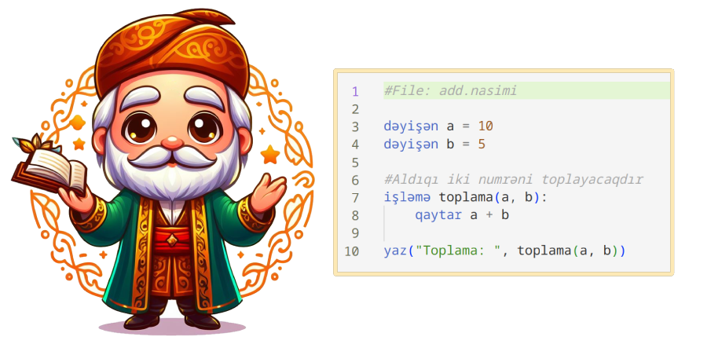

<p align="center">
  
<h1>Nasimi <small>(POC/Experimental) v0.4</small></h1>
    The First Azerbaijani Programming Language.
</p>

# Why?
To facilitate programming teaching for Azerbaijani kids.

# Is it really a new programming language?
No, it's just a language layer over Python. It simply compiles code written in Azerbaijani syntax to normal Python code, then runs it through Python itself.

# Syntax Example
```python
dəyişən a = 10
dəyişən b = 5

#Aldıqı iki numrəni toplayacaqdır
işləmə toplama(a, b):
	qaytar a + b

yaz("Toplama: ", toplama(a, b))

#3 dəfə salam yaz
gəz aralıq(0,3) içində i:
	yaz("Salam")
```

# How to run
Simply run `./nasimi azj examples/azj/calculator.nasimi`

# v0.4
- Added `azb` (Azerbaijani with Arabic Alphabet) Support
- Syntax Improvments
- Added Custom Loop Syntax support for each Language
- Added VSCode Extention for AZB

# v0.3
- Custom loop added.

# v0.2
- VSCode extention added.
- Execuable `nasimi` shell command added.

# Roadmap
- Adding installer
- Making it closer to Azerbaijani grammar for better understanding
- Making a web code editor for testing and learning
- Adding Documentation

# Contribution
You're welcome to help with any of the roadmap items or by adding new ideas.

<a href="https://buymeacoffee.com/arazgholami"></a>

# Licence
MIT

# Contact 
Araz Gholami - Email: contact@arazgholami.com
