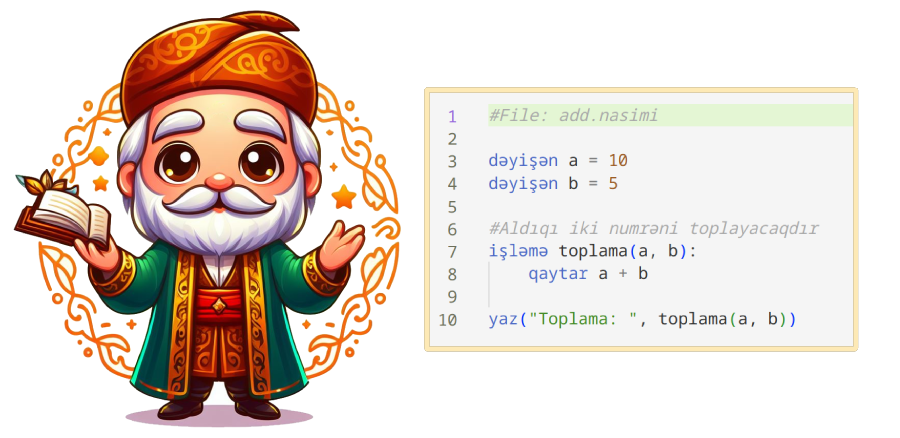

<p align="center">
  
</p>

# Nasimi 1.0

Nasimi 1.0 is an experimental Azerbaijani language layer over Python. It helps Azerbaijani-speaking children learn programming with familiar words while still running on Python underneath.

Nasimi currently supports:

- `azj`: Azerbaijani with Latin alphabet
- `azb`: Azerbaijani with Arabic alphabet
- terminal execution through the `nasimi` command
- local browser playground through `nasimi serve`
- VS Code syntax support packages for both alphabets

## Install

```bash
./install
nasimi azj examples/azj/sayHello.nasimi
```

The installer creates a `nasimi` command in `~/.local/bin` by default. To install somewhere else:

```bash
NASIMI_INSTALL_DIR=/usr/local/bin ./install
```

## Usage

Old short form:

```bash
nasimi azj examples/azj/calculator.nasimi
nasimi azb examples/azb/calculator.nasimi
```

Explicit commands:

```bash
nasimi run azj examples/azj/calculator.nasimi
nasimi translate azj examples/azj/calculator.nasimi
nasimi serve
```

`nasimi serve` starts the local playground API and prints a browser URL. The static `playground.html` page can be opened anywhere, but code execution requires the local server because browsers cannot run the local Python binary directly.

## AZJ Example

```python
qoy adlar = ["Aylin", "Tural", "Leyla"]

funksiya salamla(ad):
    qaytar "Salam, " + ad

gəz adlar içində ad:
    yaz(salamla(ad))

əgər say(adlar) == 3 isə:
    yaz("Üç dost hazırdır")
əks halda:
    yaz("Siyahıya bax")
```

<h2 dir="rtl" align="right">AZB Example</h2>

<pre dir="rtl" align="right"><code>قوی adlar = ["آیلین", "تورال", "لیلا"]

فونکسییا salamla(ad):
    قایتار "سلام، " + ad

گز adlar ایچینده ad:
    یاز(salamla(ad))

اگر سای(adlar) == 3 ایسه:
    یاز("اوچ دوست حاضردیر")
عکس حالدا:
    یاز("لیسته‌یه باخ")
</code></pre>

## Documentation

Read [docs.html](docs.html) for the web documentation, or [DOCUMENTATION.md](DOCUMENTATION.md) for the Markdown version. Both include the full bilingual reference, grammar examples, command list, and vocabulary tables.

Project pages:

- [index.html](index.html): GitHub Pages introduction
- [docs.html](docs.html): HTML documentation
- [playground.html](playground.html): browser playground for `nasimi serve`

## What Changed In Version 1.0

- Added `./install` for a terminal-wide `nasimi` command.
- Made the command path-safe, so it can run from any directory.
- Added `run`, `translate`, and `serve` CLI commands while keeping the old `nasimi azj file.nasimi` form.
- Reworked translation to use Python tokenization, so strings and comments are no longer accidentally translated.
- Added more natural Azerbaijani grammar forms, including `əgər ... isə`, `əks halda`, `qoy`, `funksiya`, and `gəz siyahı içində ad`.
- Added local playground execution through the same Nasimi interpreter.
- Added GitHub Pages landing page and bilingual documentation.

## Roadmap

- More classroom examples and exercises
- Better runtime error messages that point back to original `.nasimi` lines
- Packaged releases for Linux/macOS/Windows
- Expanded editor integrations

## Contributing

Contributions are welcome: grammar ideas, examples, documentation, tests, and beginner-friendly teaching material all help.

## License

MIT

## Contact

[Araz Gray](https://arazgray.com) - contact@arazgray.com
